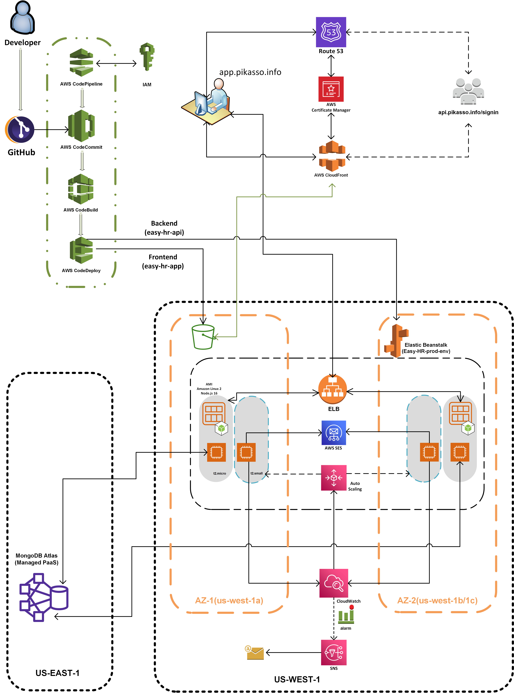

# FA22: CMPE-272 Sec 48 - Enterprise SW Platforms

University Name: **[San Jose State University](http://www.sjsu.edu)**

Course: [Enterprise SW Platforms](https://catalog.sjsu.edu/preview_course_nopop.php?catoid=12&coid=58384)

Professor: Andrew Bond [SJSU](https://www.sjsu.edu/people/andrew.bond/)

## 1. Students

Nihal Kaul [Linkedin](https://www.linkedin.com/in/nihalwashere)

Utsav Rawat [Linkedin](https://www.linkedin.com/in/utsav-rawat-a519aa131)

Jaya Krishna Thupili [Linkedin](https://www.linkedin.com/in/thupili)

## 2. Project Introduction
EasyHR is an application-based human resource management system. Every organization, whether government or private, uses an information system to store the data of their staff. EasyHR manages the administrative tasks of the human resource department, which involves the following.
1.	Provides a portal for employees to access human resource related activities and information. 
2.	Calculating their effective payable hours or days. 
3.	Secure mechanism to access the platform (SSO). 
4.	The system includes a user feedback section, for which employees can share their thoughts on areas of success or improvement needed in the workplace. This feedback helps employees to be heard and for management to take account of the necessary steps for prioritizing impactful agendas. 
5.	It will let users sign in and input their timetable for each day of work, where managers can manage employee details, and employees can mark their attendance and fill in their daily task details. 
6.	It will also calculate overtime and the total working hours of each employee. 
7.	A single instance of the program will be able to serve multiple user groups under a multitenant architecture. These user groups are called tenants.

## 3. Architecture


## 4. Local setup ad Configuration

```bash
$ cd easy-hr-app/
$ npm install
$ npm start
```
## 5. Sigin

Open sigin page @             http://localhost:3000
